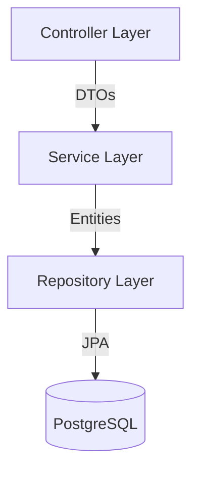

# 🍔 Cardápio Pro API

Backend robusto e escalável para sistema de cardápio digital e delivery, desenvolvido com **Java 21** e **Spring Boot 3**.


---

## 🚀 Sobre o Projeto

O **Cardápio Pro API** é o motor de um sistema completo de delivery, permitindo gerenciamento de catálogo, produtos complexos com adicionais, e fluxo completo de pedidos.

### 🌟 Principais Funcionalidades

- **Catálogo Dinâmico:** Gestão de categorias e produtos.
- **Sistema de Adicionais:** Flexibilidade para personalizar produtos (ex: "Sem cebola", "Borda recheada", "Bacon extra").
- **Gestão de Pedidos:** Fluxo completo desde a criação até a entrega, com validação de status.
- **API Documentada:** Documentação interativa com Swagger UI.
- **Padrões de Projeto:** Arquitetura em camadas (Controller, Service, Repository), DTOs, e tratamento global de erros.

---

## 🛠️ Tecnologias Utilizadas

- **Linguagem:** Java 21 LTS
- **Framework:** Spring Boot 3.5.10
- **Banco de Dados:** PostgreSQL 15
- **Migração de Dados:** Spring Data JPA + Seeds SQL
- **Documentação:** SpringDoc OpenApi (Swagger)
- **Containerização:** Docker & Docker Compose
- **Ferramentas:** Maven, Lombok, Bean Validation

---

## 🏗️ Arquitetura

O projeto segue uma arquitetura limpa dividida em camadas:



- **Controller:** Recebe requisições HTTP e valida dados (DTOs).
- **Service:** Contém a lógica de negócio e regras de validação.
- **Repository:** Interface de comunicação com o banco de dados via JPA.
- **Global Exception Handler:** Centraliza e padroniza as respostas de erro da API.

---

## ⚙️ Como Executar

### Pré-requisitos

- Java 21+ instalado
- Docker & Docker Compose instalados
- Maven instalado

### Passo a Passo

1. **Clone o repositório**

   ```bash
   git clone https://github.com/adrian08041/cardapio-backend.git
   cd cardapio-backend
   ```

2. **Suba o banco de dados**

   ```bash
   docker-compose up -d
   ```

3. **Execute a aplicação**

   ```bash
   mvn spring-boot:run
   ```

4. **Acesse a Documentação (Swagger)**
   Abra no navegador: [http://localhost:8080/swagger-ui.html](http://localhost:8080/swagger-ui.html)

---

## 📚 Documentação da API

### Principais Endpoints

| Recurso        | Método | Endpoint                     | Descrição                     |
| -------------- | ------ | ---------------------------- | ----------------------------- |
| **Categories** | GET    | `/api/v1/categories`         | Listar categorias ativas      |
| **Products**   | GET    | `/api/v1/products`           | Listar produtos               |
| **Products**   | POST   | `/api/v1/products`           | Criar produto com categoria   |
| **Addons**     | GET    | `/api/v1/addons`             | Listar adicionais disponíveis |
| **Orders**     | POST   | `/api/v1/orders`             | Criar novo pedido             |
| **Orders**     | PATCH  | `/api/v1/orders/{id}/status` | Atualizar status do pedido    |

> Para ver todos os endpoints e testar, use o Swagger.

---

## 🗄️ Estrutura do Banco de Dados

### Tabelas Principais

- `categories`: Categorias do cardápio.
- `products`: Produtos principais.
- `addon_categories`: Grupos de adicionais (ex: "Molhos", "Tamanho").
- `addons`: Itens adicionais individuais.
- `product_addon_categories`: Vínculo N:N entre produtos e grupos de addons.
- `orders`: Cabeçalho do pedido.
- `order_items`: Itens do pedido.
- `order_item_addons`: Adicionais escolhidos para cada item.

---

## 🤝 Contribuindo

1. Faça um Fork do projeto
2. Crie sua Feature Branch (`git checkout -b feature/MinhaFeature`)
3. Commit suas mudanças (`git commit -m 'feat: Adiciona nova funcionalidade'`)
4. Push para a Branch (`git push origin feature/MinhaFeature`)
5. Abra um Pull Request

---

## 📝 Licença

Este projeto está sob a licença MIT. Veja o arquivo [LICENSE](LICENSE) para mais detalhes.

---

Desenvolvido com 💙 por **Adrian**.
